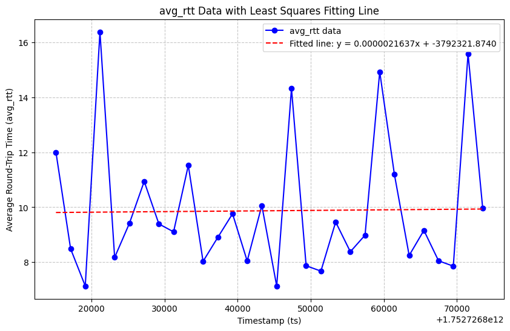

中文 | [English](README_en.md)
# udp_bench简介
udp_bench是基于rust tokio异步库开发的udp压测工具:
* 高性能: 基于tokio的异步高性能吞吐；
* 跨平台: rust tokio的跨平台

可用于测试服务器之间的udp连接情况：
* 连通性
* 探测带宽大小
* rtt延时
* 丢包率

# 编译
安装rust，执行
```
cargo build
```

# 运行

## udp服务端
```
./target/debug/udp_server_bench -l 152.136.169.211 -p 9898
```
* -l 设置监听地址
* -p 设置udp监听端口

## udp客户端
```
./target/debug/udp_client_bench -s 192.168.40.245 -p 9898 -c 152.136.169.211 -r 7878 -k 2000
```
* -s 设置服务端的ip
* -p 设置服务端的udp端口
* -c 设置客户端的ip地址
* -r 设置客户端的udp端口
* -k 设置发送流量大小，单位kbps

## 测试结果：
### rtt结果
```
tail -n 10 rtt_stats.json
{"ts":1752726855409,"rtt":8.0,"avg_rtt":8.379359,"seq":8987}
{"ts":1752726857420,"rtt":6.0,"avg_rtt":8.983239,"seq":9436}
{"ts":1752726859428,"rtt":9.0,"avg_rtt":14.932756,"seq":9884}
{"ts":1752726861437,"rtt":7.0,"avg_rtt":11.19528,"seq":10332}
{"ts":1752726863457,"rtt":9.0,"avg_rtt":8.244389,"seq":10780}
{"ts":1752726865473,"rtt":13.0,"avg_rtt":9.156795,"seq":11230}
{"ts":1752726867478,"rtt":6.0,"avg_rtt":8.048859,"seq":11681}
{"ts":1752726869498,"rtt":7.0,"avg_rtt":7.8547807,"seq":12130}
{"ts":1752726871513,"rtt":15.0,"avg_rtt":15.589755,"seq":12577}
{"ts":1752726873519,"rtt":17.0,"avg_rtt":9.958101,"seq":13026}
```
结果的日志包含信息:
* 发送kbps，pps和总数
* 实时rtt和平均rtt
* 丢包数，丢包率

### 收发报文和丢包率
```
cat total_stats.json
{"sent":13396,"received":13382,"lost":14,"lost_percent":0.10450881}
```

### avg_rtt 图标

通过rtt_stats.json绘制rtt变化曲线
```
python report.py
```
曲线包括avg_rtt和最小二乘法的曲线:
