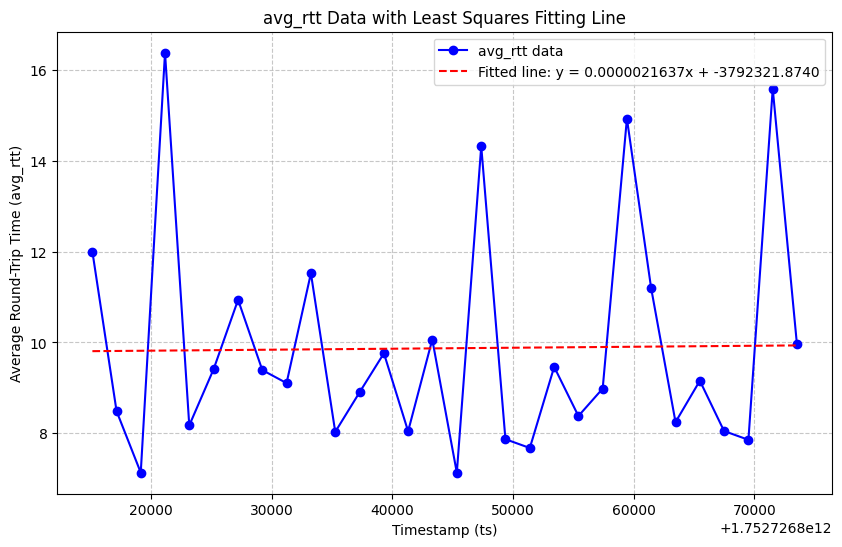

(中文)[README.md] | English
# udp_bench Introduction
udp_bench is a UDP benchmarking tool developed based on Rust's Tokio asynchronous library:
* High Performance: High-throughput performance based on Tokio's asynchronous capabilities
* Cross-platform: Cross-platform support thanks to Rust and Tokio

It can be used to test UDP connections between servers:
* Connectivity
* Bandwidth measurement
* RTT (Round-Trip Time) latency
* Packet loss rate

# Compilation
Install Rust, then run:
```
cargo build
```


# Usage

## UDP Server
```
./target/debug/udp_server_bench -l 152.136.169.211 -p 9898
```
* -l Set listening address
* -p Set UDP listening port

## UDP Client
```
./target/debug/udp_client_bench -s 192.168.40.245 -p 9898 -c 152.136.169.211 -r 7878 -k 2000
```
* -s Set server IP address
* -p Set server UDP port
* -c Set client IP address
* -r Set client UDP port
* -k Set traffic sending rate in kbps

## Test Results:
### RTT Results
```
tail -n 10 rtt_stats.json
{"ts":1752726855409,"rtt":8.0,"avg_rtt":8.379359,"seq":8987}
{"ts":1752726857420,"rtt":6.0,"avg_rtt":8.983239,"seq":9436}
{"ts":1752726859428,"rtt":9.0,"avg_rtt":14.932756,"seq":9884}
{"ts":1752726861437,"rtt":7.0,"avg_rtt":11.19528,"seq":10332}
{"ts":1752726863457,"rtt":9.0,"avg_rtt":8.244389,"seq":10780}
{"ts":1752726865473,"rtt":13.0,"avg_rtt":9.156795,"seq":11230}
{"ts":1752726867478,"rtt":6.0,"avg_rtt":8.048859,"seq":11681}
{"ts":1752726869498,"rtt":7.0,"avg_rtt":7.8547807,"seq":12130}
{"ts":1752726871513,"rtt":15.0,"avg_rtt":15.589755,"seq":12577}
{"ts":1752726873519,"rtt":17.0,"avg_rtt":9.958101,"seq":13026}
```
The result logs contain the following information:
* Sent kbps, packets per second (pps), and total count
* Real-time RTT and average RTT
* Packet loss count and packet loss rate

### Sent/Received Packets and Packet Loss Rate
```
cat total_stats.json
{"sent":13396,"received":13382,"lost":14,"lost_percent":0.10450881}
```
### Average RTT Graph
Generate an RTT trend chart from rtt_stats.json:
```
python report.py
```
The chart includes the average RTT and a least-squares regression curve:
